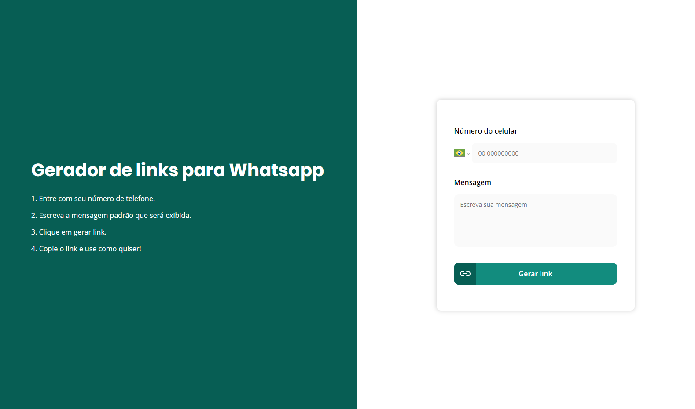

# :page_with_curl: Sobre

O WhatsApp permite criar e gerar links para o seu número que, ao serem clicados, iniciam uma conversa direta com você. O truque grátis está disponível para celulares Android e iPhone (iOS) e pode ser feito manualmente, a partir de um código disponibilizado pelo mensageiro, ou por meio de ferramentas na web. Esse serviço também possibilita incluir uma mensagem padrão para iniciar a conversa. Vale lembrar que a prática de divulgar endereços eletrônicos direcionados ao mensageiro publicamente é mais comum em contas comerciais, para facilitar o contato com os clientes.

#### Criar o link manualmente

1. Copie o código a seguir: https://api.whatsapp.com/send?phone=SeuNúmero

2. Substitua o termo "SeuNúmero" pelo número do seu telefone, incluindo o código do país e o DDD. No exemplo a seguir, utilizamos o DDI "55", do Brasil, e o código "11", da cidade de São Paulo: https://api.whatsapp.com/send?phone=5511012345678

#### Criar um link com mensagem

1. Copie o código a seguir: https://api.whatsapp.com/send?phone=SeuNúmero&text=SuaMensagem

2. Além de substituir o número do telefone, substitua também o termo "SuaMensagem" pelo texto que desejar. Como links não permitem inserir espaços, troque-os pelo código "%20" (sem aspas), como no exemplo a seguir: https://api.whatsapp.com/send?phone=5511012345678&text=Oi%20TechTudo

#### Criar link com um site gerador

Outra opção possível para criar um link para o WhatsApp é a partir de plataformas terceiras, como o [Gerador de link para Whatsapp](https://www.rbmelolima.com.br/gerador-link-whatsapp/). Para gerar o endereço online, também é preciso informar o número do telefone.

## :hammer: Instalação
````bash
# Clone este projeto
$ git clone https://github.com/rbmelolima/MeuZap

## Vá até a pasta
$cd MeuZap

# Instale as dependências
$ yarn 

# Inicie a aplicação
$ yarn start
````

